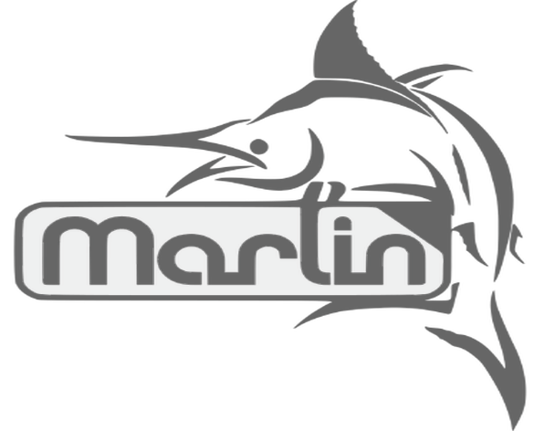

# Ender-3
I run a small print farm for my business, fordworks3D, LLC. It is currently made up of 4 Ender 3 Pros, and this is where you can find my project upgrades, Octoprint network setup, Marlin configurations, and more.

    

             

## Parts List
These are the things I buy when I want to add another printer to the line. Things not included are JST connectors, solder, wire, filament, labels, and other supplies. This list is ordered by priority of what I personally feel are the most to least essential upgrades to your Ender 3. In total, each printer costs ~$700.
| Type | Item | Price |
|--|--|--|
| 3D Printer | [Creality Ender 3 Pro](https://www.creality3dofficial.com/products/creality-ender-3-pro-3d-printer) | $249 |
| Control Board | [BIGTREETECH SKR Mini E3 V2.0](https://www.biqu.equipment/products/bigtreetech-skr-mini-e3-v2-0-32-bit-control-board-integrated-tmc2209-uart-for-ender-3) | $35 |
| Build Plate | [220mm x 220mm x 3mm Borosilicate Glass Bed](https://www.amazon.com/s?k=220mm+borosilicate+glass+bed) | $20 |
| Extruder | [E3D Hemera](https://e3d-online.com/collections/hotends/products/e3d-hemera-direct-kit-1-75mm) | $110 |
| Leveling Probe | [Differential IR Height Sensing Probe](https://www.amazon.com/gp/product/B07RKTQ53F/ref=ppx_yo_dt_b_asin_title_o00_s00?ie=UTF8&psc=1) | $16 |
| Cooling Fans | [24V Brushless High Speed Radial Fans](https://www.amazon.com/WINSINN-Bearing-50x50x15mm-Extruder-Makerbot/dp/B07DB7DLMM/ref=sr_1_4?dchild=1&keywords=radial+fan+24v+3d+printing&qid=1608193216&sr=8-4) | $10 |
| Hotend | [E3D Supervolcano Kit with Extra Nozzles](https://e3d-online.com/collections/hotends/products/supervolcano-upgrade-kit) | $117 |
| Octoprint Host | [Raspberry Pi 4 B, 4GB RAM with Heatsinks and Power Supply](https://vilros.com/collections/raspberry-pi-4/products/raspberry-pi-4-4gb-ram) | $78 |
| Mini USB | [USB Type A to Mini B Cable, 3ft](https://www.amazon.com/s?k=Mini+usb+cable&ref=nb_sb_noss_2) | $10 |
| Camera | [Raspberry Pi Camera, 1080p, 5MP](https://www.amazon.com/s?k=raspberry+pi+cam&ref=nb_sb_noss) | $10 |
| Smart Outlet | [Wemo Mini Smart Outlet](https://www.bestbuy.com/site/wemo-mini-wifi-smart-plug-white/5711458.p?skuId=5711458&ref=212&loc=1) | $20 |
| Table | [Ikea Lack Endtable](https://www.ikea.com/us/en/p/lack-side-table-black-20011408/) | $10 |

## Software Used
Relevant files and setup instructions are linked accordingly.
| Category | Name | Description |
|--|--|--|
| Firmware | [Marlin](https://marlinfw.org) | Open source firmware for configuring your 3D printer/CNC/Laser. My files can be found here (LINK) |
| STL Slicer | [Slic3r](https://slic3r.org) | Open source STL slicer. Profiles found here (LINK) |
| CAD | [Fusion 360](https://www.autodesk.com/products/fusion-360/overview) | Autodesk's cross-platform, free for non-commercial use CAD software (See [startup edition](https://www.autodesk.com/products/fusion-360/startups) for small businesses) |
| Printer Controller | [Octoprint](https://octoprint.org) | An open source web interface for 3D printer monitoring and control. |
| Farm Viewer | [Octofarm](https://octofarm.net) | Open source web server/client for managing several Octoprint instances. |